# Accessible Tic-Tac-Toe
## Setting up on your local machine
1. Ensure that [node.js](https://nodejs.org/en/) is installed on the machine.
1. Open a terminal shell in both the backend and frontend packages of this project and run `npm install` in each of them to install the project dependencies.
1. This application requires a connection to a MongoDB database. In order to link one to the backend, go to the file ./backend/.env and paste the database URI in between the quotation marks of the `MONGODB_URI` variable. To gain access to a free MongoDB cloud service, check out [MongoDB Atlas](https://www.mongodb.com/atlas/database).
1. To start the backend server, run `node index.js` in the backend package.
1. To start the frontend application, run `npm start` in the frontend package.
1. After following these steps, the application should be good to go.

## Testing demo
Please refer to the link attach in the submission email.

## Playing the game on multiple instances
1. The game can be played using multiple browser sessions or even multiple tabs in a single browser session. In either methods, after starting both the backend and frontend, navigate to `http://localhost:3000` on each browser session/tab.
1. After entering the player's name, you will be able to create or join game sessions in the next page, which looks like this:

    
1. When two players are in the same session, the game will start.

## List of APIs
Below is the list of HTTP APIs provided by the backend, as well as example requests and responses. Note that URL parameters are denoted by a colon, followed by the parameter name (e.g. `:sessionNum`).
- `GET /`
    - Fetches a list of all ongoing sessions in the current server instance
    - Example request:
        
        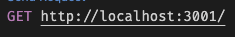
    - Example response:

        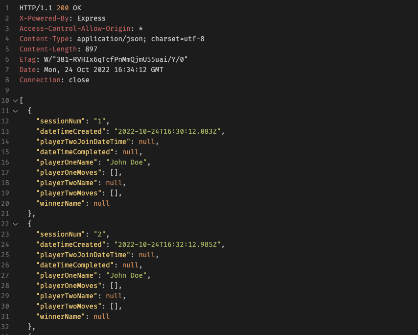
- `GET /available`
    - Fetches a list of all sessions available for another player to join in the current server instance
    - Example request:

        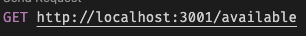
    - Example response:

        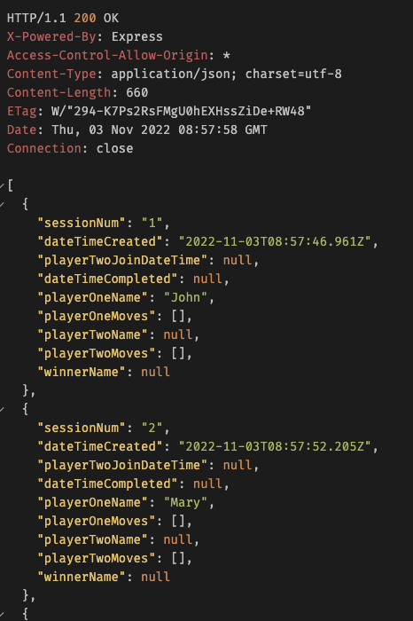
- `GET /past`
    - Fetches a list containing information of all past completed games
    - Example request:

        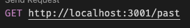
    - Example response:

        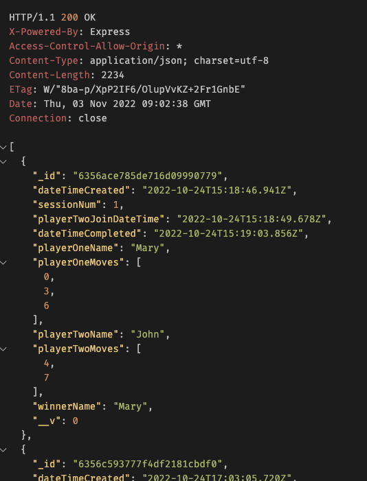
- `POST /`
    - Creates a new game session
    - Requires the name of the creating player, `creatorName` to be passed inside a JSON object in the request body.
    - The session number is automatically generated by the server.
    - Example request:
     
        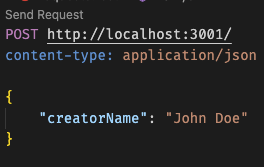
    - Example response:

        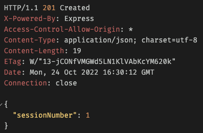
- `PUT /:sessionNum` 
    - This API is called when a player is joining an available game. Updates the session with the name of the joining player.
    - Requires the number of the target game session, `sessionNum` to be passed in as a URL parameter, and the name of the joining player, `playerName` to be passed inside a JSON object in the request body.
    - Returns response code 404 if an available game session with the given `sessionNum` does not exist.
    - Example request:

        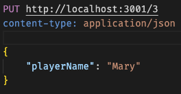
    - Example response (success):

        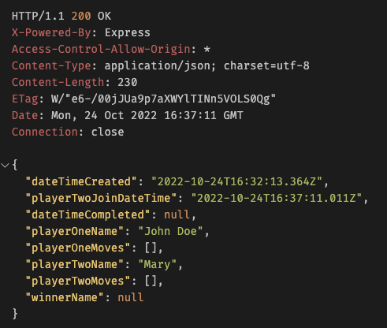

    - Example response (failed):

        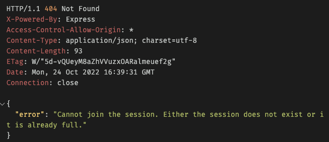
- `DELETE /:sessionNum`
    - Deletes an ongoing session.
    - Requires the number of the target game session, `sessionNum` to be passed in as a URL parameter.
    - Returns response code 404 if a game session with the given `sessionNum` does not exist.
     - Example request:

        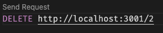
    - Example response (success):
    
        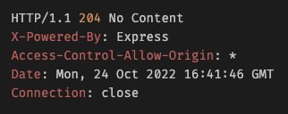

     - Example response (failed):
        
        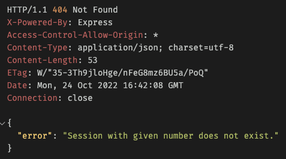

## Design Considerations
### General application design
- Since this is a multiplayer game, web sockets (using the library Socket.io) are used for fast, real-time communication between clients and the server in game sessions.
### Accessibility considerations
- Instructional text on screen have been clearly worded so that users on a screen reader will be able to fully understand what to expect at a certain page in the application.
- Since the application is dynamic in nature, measures have been taken to ensure that when there are changes occurring in the application, the user is informed (by use of the `aria-live` HTML attribute). For example, when there is a page change, the main content of the next page will be read aloud by the screen reader. Another example is during the tic-tac-toe game itself, when player turns rotate, the screen reader will also read it aloud.
- HTML elements have been carefully chosen to aid a user on a screen reader to better understand what is going on at a certain page. For example, the tic-tac-toe grid is designed using a table so that the screen reader can pinpoint which cell of the grid a user is in. The properties of each cell in the tic-tac-toe grid also changes dynamically. For instance, a `button` is used for empty cells to denote that the user can click on it, while a `div` is used instead when the cell is filled or when the game is over, to allow the user to understand that they are not able to interact with it. When it is not the user's turn, the button in an empty cell is also dimmed (using `aria-disable`) so that the user knows that they are not able to press it currently, but can do so later on when it is their turn.

## Architecture diagram
Below illustrates the architecture of the program, and describes components used in it.
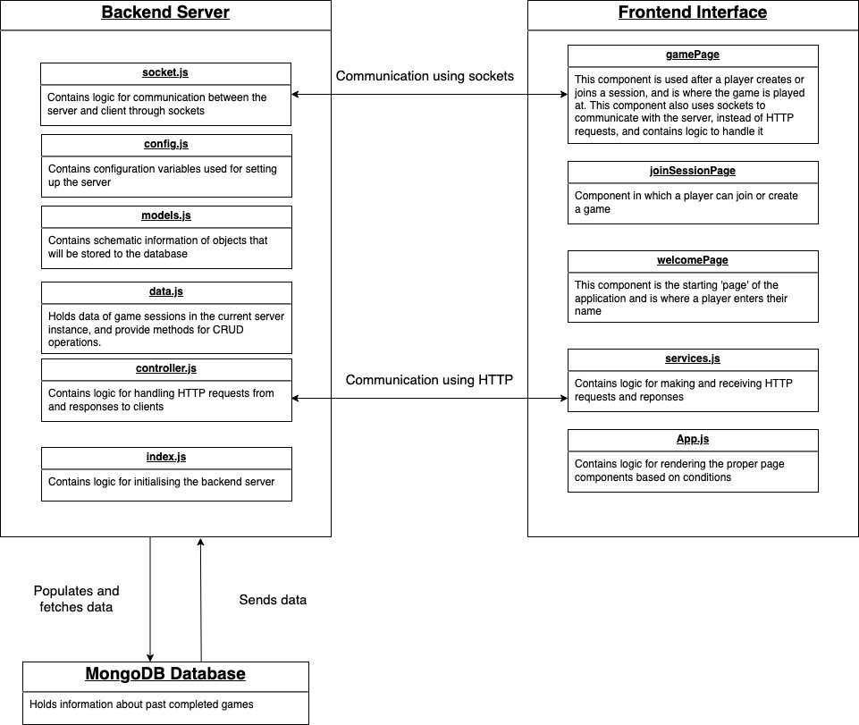

## Assumptions
Below are a list of assumptions made about the specifications of the assessment.
- Players already know the rules of Tic-Tac-Toe
- The server will only save data of completed games for future retrieval
- Game sessions do not have to be persistent. That is, when the server closes, all sessions will be wiped
- Players can create sessions themselves

## Other notes
Player moves during the game are recorded as indexes of the cells they select. The following diagram shows how indexes are allocated on the grid:

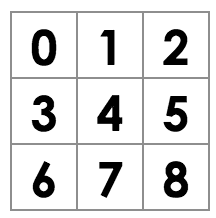